# Architecture

How the card is wired together. The current shape is the result of
several refactor rounds: v1.1 split the original 2,200-line `main.js`
monolith into focused modules, v1.2 migrated everything to TypeScript,
v1.9.x reorganized the editor partials around user intent rather than
technical structure, and the v2 cycle (May 2026) added a resilience
layer (config validation, graceful degradation, debug overlay), swapped
the charting library from Chart.js to uPlot (ADR-0012), moved to an
ESM code-split bundle with a lazy editor chunk (ADR-0013), and made the
card theme-token-aware. `main.ts` is now ~3,000 LOC of orchestrator —
it holds reactive properties, wires the data sources, and delegates
behaviour to the modules below.

If you're new to the codebase, read this in order: **[Module map](#module-map)**
→ **[Lifecycle](#lifecycle)** → **[Data flow](#data-flow)**, then dive
into the file you need to change.

## Module map

```
src/
├── main.ts                    LitElement WeatherStationCard. Entry
│                              point + thin orchestrator. Holds reactive
│                              properties (hass, config, forecasts),
│                              wires the data sources, calls into the
│                              modules below. The `set hass` setter is
│                              a 12-line orchestrator that delegates to
│                              three private phase methods (see
│                              [Lifecycle](#lifecycle)). This is the
│                              HA integration boundary — strictly typed
│                              under `tsc`, with `any` confined to the
│                              undocumented HA-frontend slots and
│                              eslint-disable lines limited to those
│                              exact spots (ADR-0004).
│
├── defaults.ts                (v1.9)  Single source of truth for the
│                              card's configuration defaults: DEFAULTS,
│                              DEFAULTS_FORECAST, DEFAULTS_UNITS. Both
│                              `setConfig` (user YAML merge) and
│                              `getStubConfig` (visual-editor "first
│                              add" path) consume this object so the
│                              two cannot drift (ADR-0008).
│
├── config-validation.ts       (v2)  Advisory config validator —
│                              raw user YAML → list of human-readable
│                              problems (unknown keys, wrong-typed
│                              values, "did you mean X?" typo hints).
│                              Never throws; the allowed key set is
│                              derived from DEFAULTS so it cannot
│                              drift (ADR-0008). Surfaced through
│                              `renderErrorBanner()`.
│
├── data-source.ts             MeasuredDataSource (recorder polling)
│                              and ForecastDataSource (weather/subscribe_
│                              forecast). Both expose subscribe(cb) →
│                              unsubscribe and emit { forecast, error? }.
│                              Also hosts `fetchPressure3hDelta` +
│                              `PressureDeltaCache` for the live
│                              pressure-trend row.
│
├── condition-classifier.ts    Pure decision-tree classifier — feed it
│                              temp/humidity/wind/lux/precip and it
│                              returns one of HA's weather condition
│                              IDs. Day / hour period dispatch. Also
│                              exports `clearSkyLuxAt` (clear-sky lux
│                              reference used by the live rows).
│
├── precip-rate.ts             (v2)  Live precipitation-rate derivation
│                              from a cumulative rain counter. Keeps a
│                              15-min sliding sample buffer and divides
│                              Δvalue by wall-clock Δtime so the rate
│                              decays to zero when ticks stop.
│
├── pressure-trend.ts          (v2)  Pressure-tendency classifier for
│                              the live-panel pressure row. 5-class WMO
│                              3-hour scheme; hard-coded thresholds.
│
├── dew-point-comfort.ts       (v2)  Dew-point comfort classifier for
│                              the live-panel dew-point row. Five
│                              first-match-wins bands (Raureif > Nebel
│                              > Schwül > Tau > Komfort).
│
├── sun-strength.ts            (v2)  Sun-strength classifier for the
│                              live-panel sun row — merges UV index +
│                              illuminance into a cloud-aware sun/moon
│                              icon; WHO 5-tier UV bands. Pure.
│
├── forecast-utils.ts          Pure helpers: hourlyTempSeries,
│                              normalizeForecastMode, startOfTodayMs,
│                              filterMidnightStaleForecast,
│                              aggregateThreeHour, the forecast-fetch
│                              key/equality helpers + the v1.0.2
│                              midnight-transition guards.
│
├── format-utils.ts            Pure helpers for color parsing,
│                              separator-position algebra,
│                              computeInitialScrollLeft.
│
├── sunshine-source.ts         attachSunshine + overlayFromOpenMeteo —
│                              tags every forecast entry with a daily
│                              or hourly sunshine value.
│
├── openmeteo-source.ts        Open-Meteo API fetcher with localStorage
│                              caching, abortable on disconnect.
│
├── scroll-ux.ts               Wraps the .forecast-scroll-block: drag-
│                              to-scroll, indicator chevrons, jump-to-now
│                              button, scroll-date overlays.
│                              setupScrollUx(card) returns a teardown.
│
├── action-handler.ts          Pointer-based tap / hold / double-tap
│                              detection on ha-card + dispatcher
│                              (more-info, navigate, url, toggle,
│                              perform-action, assist, fire-dom-event).
│                              setupActionHandler(card) + runAction.
│
├── teardown-registry.ts       Lifecycle-cleanup primitive. Test-covered
│                              and ready for wider use, but currently
│                              only partially wired — depcruise allow-
│                              lists it as a documented orphan exception
│                              pending full re-integration.
│
├── const.ts                   weatherIcons / cardinal-direction tables,
│                              MIN_HA_VERSION + isHaVersionBelow (v2
│                              HA-version compatibility check).
│
├── locale.ts                  Locale registry + on-demand loader. Only
│                              English is eager (guaranteed fallback);
│                              every other language is a lazy chunk.
│
├── locale-types.ts            Shared locale types, split into their own
│                              file so per-language tables can import
│                              them without forming a dependency cycle.
│
├── locales/                   23 per-language string tables, one file
│                              each (de.ts, fr.ts, …). Lazy-loaded
│                              chunks — only the user's language is
│                              fetched at runtime.
│
├── icons/                     Bundled SVG weather-condition icons,
│                              copied verbatim to dist/icons/ by the
│                              build (rollup-plugin-copy).
│
├── utils/
│   ├── safe-query.ts          shadowRoot?.querySelector helper.
│   ├── numeric.ts             parseNumericSafe — returns null instead
│   │                          of NaN on un-parseable input.
│   ├── intl-cache.ts          (v2)  Process-wide cache of
│   │                          Intl.DateTimeFormat / NumberFormat
│   │                          instances keyed by (language, options).
│   ├── resolve-css-var.ts     (v2)  Expands a `var(--token, fallback)`
│   │                          string against computed style for the
│   │                          chart colour path; pass-through for
│   │                          plain colour literals.
│   ├── theme-tokens.ts        (v2)  Caches the HA theme CSS custom
│   │                          properties the chart re-reads on every
│   │                          redraw; a MutationObserver on <html>
│   │                          invalidates the cache on theme switch.
│   └── unit-converters.ts     (v2)  Pure wind / pressure unit-
│                              conversion lookup tables (ADR-0009).
│
├── chart/
│   ├── orchestrator.ts        drawChartUnsafe(card, args) — assembles
│   │                          datasets + plugins, calls buildChart.
│   │
│   ├── draw.ts                uPlot instance builder — buildChart(ctx,
│   │                          opts) returns a configured uPlot chart
│   │                          (replaced the Chart.js builder, ADR-0012).
│   │
│   ├── plugins.ts             Barrel re-export of the five chart
│   │                          plugin factories under plugins/.
│   │
│   ├── plugins/               Per-plugin source: _shared.ts (the
│   │                          ChartLike contract), separator.ts,
│   │                          daily-tick-labels.ts, precip-label.ts,
│   │                          sunshine-label.ts, temp-labels.ts.
│   │
│   ├── sanitize.ts            (v2)  Pure defensive sanitisers for the
│   │                          chart data path — drop null/malformed
│   │                          forecast entries before they reach the
│   │                          chart. Never throws.
│   │
│   ├── skeleton.ts            (v2)  Loading placeholder rendered in
│   │                          place of the chart while data sources
│   │                          are still firing — a CSS shimmer sweep
│   │                          that reserves the chart's vertical
│   │                          space so the swap doesn't reflow.
│   │
│   └── styles.ts              cardStyles({...}) — returns the CSS
│                              string for the card's <style> block.
│
├── editor/                    (v1.9 reorg)  Editor render partials.
│   │                          Sections cluster by user intent rather
│   │                          than by technical concern — see ADR-0005.
│   ├── types.ts               Shared types: EditorLike, EditorContext,
│   │                          TFn, ChangeEvt.
│   ├── section-header.ts      Shared <h3> section-heading helper that
│   │                          wires the per-section reset-to-defaults
│   │                          button.
│   ├── section-keys.ts        Per-section config-key inventories the
│   │                          reset buttons delete. A CI drift guard
│   │                          (editor-schema test) keeps this in sync
│   │                          with the section schemas.
│   ├── render-mode.ts         Section 1 — "Karte einrichten" / Card
│   │                          setup. Mode (station/forecast/combination)
│   │                          and chart-type radios.
│   ├── render-forecast.ts     Section 2 — "Wettervorhersage" / Weather
│   │                          forecast. weather_entity picker.
│   ├── render-sensors.ts      Section 3 — "Sensoren" / Sensors. Past-
│   │                          data window (days) + sensor pickers
│   │                          (ha-form, ranked auto-detect).
│   ├── render-chart.ts        Section 4 — "Diagramm" / Chart. Time
│   │                          range, chart rows, appearance/style.
│   ├── render-live-panel.ts   Section 5 — "Live-Anzeige" / Live panel.
│   │                          Main panel + attributes-row toggles.
│   ├── render-units.ts        Section 6 — "Einheiten" / Units.
│   └── render-tap.ts          Section 7 — "Aktionen" / Actions. Tap /
│                              hold / double-tap selectors.
│
└── weather-station-card-editor.ts   LitElement editor host. Owns
                               mutator methods (_valueChanged,
                               _sensorsChanged, _conditionMappingChanged,
                               _setMode, _resetSection,
                               _renderSunshineAvailabilityHint, etc.);
                               render() delegates to the seven partials
                               above. Lazy-loaded as its own chunk
                               (ADR-0013).
```

### Module dependency graph

```mermaid
graph TD
    main[main.ts]
    main --> defaults[defaults.ts]
    main --> cfgval[config-validation.ts]
    main --> data[data-source.ts]
    main --> classifier[condition-classifier.ts]
    main --> fcutils[forecast-utils.ts]
    main --> fmtutils[format-utils.ts]
    main --> sunshine[sunshine-source.ts]
    main --> openmeteo[openmeteo-source.ts]
    main --> scroll[scroll-ux.ts]
    main --> action[action-handler.ts]
    main --> liverows[precip-rate / pressure-trend / dew-point-comfort / sun-strength]
    main --> orchestrator[chart/orchestrator.ts]
    main --> skeleton[chart/skeleton.ts]
    main --> styles[chart/styles.ts]
    main --> locale[locale.ts]
    main --> const[const.ts]
    main --> utils[utils/*]
    main -. lazy import .-> editor[weather-station-card-editor.ts]
    editor --> defaults
    editor --> editorTypes[editor/types.ts]
    editor --> editorParts[editor/render-*.ts + section-*.ts]
    editorParts --> editorTypes
    cfgval --> defaults
    locale -. lazy import .-> locales[locales/*.ts]
    locale --> localeTypes[locale-types.ts]
    sunshine --> openmeteo
    data --> classifier
    liverows --> classifier
    orchestrator --> draw[chart/draw.ts]
    orchestrator --> plugins[chart/plugins.ts]
    orchestrator --> sanitize[chart/sanitize.ts]
    orchestrator --> fcutils
    orchestrator --> fmtutils
    orchestrator --> sunshine
    orchestrator --> themeUtils[utils/theme-tokens.ts + resolve-css-var.ts]
    plugins --> fmtutils
    scroll --> utils
    action --> utils
```



## Lifecycle

The card is a Lit reactive element. The interesting hooks:

```
static assertConfig(config)
  └─ structural pre-flight check — throws so HA falls back to the
     YAML editor instead of trying (and failing) to render the
     visual editor against an invalid config.

setConfig(config)
  ├─ defaults applied (DEFAULTS / DEFAULTS_FORECAST / DEFAULTS_UNITS)
  ├─ validateConfig(config) — advisory; problems queued for the
  │     error banner, never blocks the render
  ├─ invalidation flags reset
  └─ mode-aware required-key validation
     (station mode → sensors.temperature; forecast → weather_entity)

set hass(hass)               ← v1.9.x: 12-line orchestrator (ADR-0007)
  ├─ this._hass / language / sun (3 lines)
  ├─ _extractSensorReadings(hass)
  │     Phase 1 — sensor entity reads, source-unit detection,
  │     weather_entity attribute fallback for forecast-only mode.
  │     Mutates this.<reading> + this._sourceWindUnit etc.
  ├─ _classifyLiveCondition(hass)
  │     Phase 2 — minute-memoized classifier + synthesized weather
  │     stand-in. Same classifier as forecast columns, fed with
  │     instantaneous values + an instantaneous clear-sky reference.
  └─ _syncDataSources(hass)
        Phase 3 — subscribe / unsubscribe MeasuredDataSource and
        ForecastDataSource to match show_station / show_forecast,
        scan for missing sensor entities. Symmetrical to
        disconnectedCallback's teardown side.

connectedCallback()
  └─ schedules attachResizeObserver

firstUpdated()
  └─ measureCard → drawChart  (skeleton shown until first data lands)

updated(changedProperties)
  ├─ setupActionHandler(this)        ← idempotent on stable ha-card
  ├─ _maybeApplyInitialScroll(...)
  ├─ setupScrollUx(this)             ← idempotent on stable wrapper
  └─ if config changed:
       _invalidateStaleSources(oldConfig)

data callbacks (from sources):
  this._stationData / this._forecastData ← event.forecast
  └─ _refreshForecasts()
       ├─ midnight-transition guards
       │   (filterMidnightStaleForecast, dropEmptyStationToday)
       ├─ overlayFromOpenMeteo (sunshine attach)
       └─ measureCard → drawChart

disconnectedCallback()
  ├─ detachResizeObserver
  ├─ _teardownStation / _teardownForecast
  ├─ _teardownInitialScrollObserver
  ├─ _scrollUxTeardown / _actionHandlerTeardown
  └─ clearInterval(this._clockTimer)
```

`render()` is wrapped so a thrown section never blanks the card: each
sub-section renders through `_safeSection(...)`, which records the cause
into `_sectionError` and lets `renderErrorBanner()` surface a degraded
banner instead of Lit aborting into a white card (v2 graceful-
degradation slice). With `debug: true` in YAML, `renderDebugPanel()`
appends a diagnostics panel showing the resolved entities, the chosen
render mode, and why a column came up empty.

The phase tag (`this._chartPhase`) is set at three points in
`drawChartUnsafe` (`'compute'`, `'init'`, then cleared on success). When
something throws, the catch block in `main.ts` `drawChart()` reads it
to label the error banner — useful when the error message is generic
and you need to know whether the crash was during data shaping vs.
chart init vs. plugin draw. `_refreshForecasts` follows the same
safe/unsafe split (`_refreshForecasts` → `_refreshForecastsUnsafe`).

## Data flow

The render layer always reads from `this.forecasts` — a single array
of merged station + forecast entries. Every entry has:

```ts
{
  datetime: ISOString,             // midnight of the day, local
  temperature: number | null,      // daily max
  templow: number | null,          // daily min
  precipitation: number | null,    // mm or in (depending on length unit)
  wind_speed: number | null,       // mean
  wind_gust_speed: number | null,  // daily max
  wind_bearing: number | null,     // mean degrees
  pressure: number | null,
  humidity: number | null,
  uv_index: number | null,
  condition: string,               // HA condition ID
  sunshine?: number | null,        // hours of sunshine for the day
  day_length?: number | null,      // hours from sunrise to sunset
}
```

`_refreshForecasts` is the single concatenation point:

```js
const station = this._stationData;       // 7 days
const forecast = filterMidnightStaleForecast(this._forecastData, todayStartMs)
  .slice(0, limit);                       // 7 days, no leftover yesterday
const cleaned = dropEmptyStationToday(station, todayStartMs);
this.forecasts = overlayFromOpenMeteo(
  [...cleaned, ...forecast], hass, sunshineSource, granularity
);
```

The two midnight-transition guards (added in v1.0.2) handle the corner
case where station's "today" bucket is empty (recorder hasn't
aggregated yet) and forecast's first entry is still labeled "yesterday"
(weather integration's daily forecast hasn't refreshed).

Before the merged array reaches the chart, `chart/sanitize.ts` drops
entries that cannot be drawn (null entries, missing `datetime`, NaN
numerics) so a malformed upstream shape degrades gracefully instead of
blanking the card.

## How chart labels are rendered

uPlot has no datalabels-plugin ecosystem, so **every** value label on
the chart is a custom plugin that draws directly to the canvas:

- `temp-labels.ts` — the temperature numbers above / below the line
  points (`forecast.style: 'style2'`). Replaces the
  `chartjs-plugin-datalabels` configuration from the pre-uPlot era.
- `precip-label.ts` — the precipitation amount, rendered with the
  number at base font size and the unit suffix at half size (a single
  datalabels label could never carry two font sizes — that constraint
  is now moot since all labels are custom anyway).
- `sunshine-label.ts`, `daily-tick-labels.ts`, `separator.ts` — the
  sunshine value, the daily tick captions, and the station/forecast
  boundary line.

All five plugins consume a Chart.js-shaped `ChartLike` object
(`scales.x.getPixelForTick`, `ctx`, `chartArea`, `getDatasetMeta`).
uPlot exposes none of that directly — `chart/draw.ts` builds a thin
shim from the uPlot instance at draw time and runs each plugin against
it. Keeping that contract stable across the Chart.js → uPlot swap
(ADR-0012) meant the plugin files and their unit tests carried over
unchanged; the shim costs about one object per plugin per frame.

## Build pipeline

```
npm run lint       →  eslint src tests-e2e   (ESLint 10 flat-config)
npm run typecheck  →  tsc --noEmit
npm run test       →  vitest run             (744 tests across 30 files)
npm run depcheck   →  depcruise src          (architecture rules)
npm run rollup     →  rollup -c              (ESM code-split, dist/)
npm run build      =  lint + typecheck + test + rollup
```

Rollup outputs an **ESM code-split bundle** (ADR-0013): a stable
`dist/weather-station-card.js` facade that re-exports the content-
hashed `main-<hash>.js` entry chunk, plus a lazily-imported editor
chunk and 23 lazily-imported per-language locale chunks.
`preserveEntrySignatures: 'strict'` in `rollup.config.mjs` is load-
bearing — without it the hashed chunks import the entry directly and
collide with HACS's `?hacstag=` cache-buster query, breaking
`customElements.define`.

A small inline `injectCardVersion` plugin (since v1.9.x — see ADR-0006)
replaces the literal `'__CARD_VERSION__'` in `src/main.ts` with the
version from `package.json`, so the console banner on card load stays
in sync with the released version with no manual bump.

CI (`.github/workflows/build.yml`) runs the same chain on every push,
extended with these gates:

- **Security audit**: `npm audit --audit-level=high` blocks the build
  on high/critical advisories. Lower-severity findings come as
  Dependabot PRs (`.github/dependabot.yml`, weekly).
- **Lint**: ESLint 10 with `typescript-eslint`, `eslint-plugin-lit`,
  `eslint-plugin-sonarjs`. Zero errors required; complexity warnings
  tracked as an accepted refactoring backlog (see `eslint.config.mjs`
  and `docs/QUALITY-GATES.md`). Each rule starts as `warn` while
  legacy hot-spots exist and is promoted to `error` once it reaches
  zero violations.
- **Coverage gate at ≥ 80 %** (statements, branches, functions, lines)
  for the leaf modules listed in `vitest.config.js`. `main.ts` and the
  editor host are out of coverage scope — covered by Playwright.
- **Architecture rules**: `dependency-cruiser` enforces no-circular,
  no-orphans, and module boundaries (`src/chart/`, `src/editor/`,
  `src/utils/` may not uplevel-import).
- **Bundle budget** (CI-enforced since v1.10, #111). Tripping it
  signals a tree-shaking regression or an accidental large dep.
- **Perf regression gate**: `scripts/perf-gate.cjs` compares the
  per-scenario median cold-mount timing from
  `tests-e2e/perf-render-time.spec.ts` against `perf-baseline.json`
  plus a +25 % tolerance (ADR-0014). While `perf-baseline.json` carries
  `"placeholder": true` the gate is **warn-only** — it prints the
  measured medians so the first `master` run can pin real GHA numbers.
- **Steady-state perf spec**: `tests-e2e/perf-steady-state.spec.ts`
  asserts the entity-delta gate (ADR-0017) — zero Lit update passes and
  zero uPlot redraws across 50 hass ticks where no watched entity
  changed, plus the inverse guard that a watched-entity tick still
  updates. Counter assertions gate; timing output is advisory only.
- **CodeQL** (`security-extended` queries) on every PR + weekly
  schedule, covering JS/TS security smells ESLint doesn't catch.
- **SonarCloud** (`.github/workflows/sonarcloud.yml`) reads the Vitest
  LCOV output and reports Cognitive Complexity, Code Smells, Security
  Hotspots, and Coverage trend. Advisory only — not a required check.
- **E2E + visual regression**: Playwright render-mode, editor, mobile-
  layout and scroll specs, with PNG baselines pinned to the GHA runner
  (ADR-0003).
- Verifies `dist/` is in sync with source by re-running the bundler
  in CI and comparing the output.
- On tag pushes, verifies `package.json` version matches the tag,
  then uploads the bundle as a release asset.

`permissions: contents: write` is set at job level so the release action
can attach the bundle.

The `master` branch is protected: PRs only, with `build` and
`Analyze (javascript-typescript)` required-green before merge,
linear history enforced, force-push and deletion blocked.

## Distribution

HACS pulls the latest GitHub release. The card ships as an ESM code-
split bundle (ADR-0013):

- `weather-station-card.js` — the stable filename the Lovelace
  resource URL points at; a thin facade re-exporting the hashed entry.
- `main-<hash>.js` — the actual card code.
- `weather-station-card-editor-<hash>.js` — the visual editor, fetched
  only when the user opens it.
- `<lang>-<hash>.js` — 23 per-language locale chunks, fetched on
  demand; only the user's language is loaded.
- `icons/` — SVG weather-condition icons.

Home Assistant serves each file precompressed (`.js.gz`) when the
browser supports gzip. After a local deploy to a test HA instance,
regenerate the `.gz` or HA keeps serving the stale compressed version.
Cache-busting goes through the resource URL's `?hacstag=` query — see
[`LOCAL-TESTING.md`](LOCAL-TESTING.md) and `CLAUDE.md` for the deploy
recipe.

## Testing scope

What's tested (Vitest, `tests/*.test.js`, **744 tests across 30
files**):

- `condition-classifier.ts` — every decision-tree branch, threshold
  edges, override merging, per-period (daily / hourly) thresholds.
- `data-source.ts` — `bucketPrecipitation` for all three state-class
  paths, `_buildForecast` / `_buildHourlyForecast` chronology / shape /
  live-fallback, both data-source classes' subscribe / error / dispose,
  the 3-hour pressure-delta fetch.
- `config-validation.ts` — unknown key, wrong type, typo suggestion,
  valid config passes clean.
- `format-utils.ts`, `forecast-utils.ts` — colour parsers, separator
  algebra, scroll positioning, tick selection, midnight guards.
- `sunshine-source.ts`, `openmeteo-source.ts` — attach + URL-build +
  parse paths.
- `chart/plugins/*` — every plugin factory (separator, dailyTickLabels,
  precipLabel, sunshineLabel, tempLabels).
- `chart/sanitize.ts` — every malformed-shape drop path.
- `chart/skeleton.ts` — placeholder shape + space reservation.
- `scroll-ux.ts`, `action-handler.ts`, `teardown-registry.ts` — the
  extracted interaction modules.
- The live-row classifiers — `precip-rate.ts`, `pressure-trend.ts`,
  `dew-point-comfort.ts`, `sun-strength.ts`.
- `utils/*` — safe-query, numeric, intl-cache, resolve-css-var,
  theme-tokens, unit-converters.
- `defaults.ts` — DEFAULTS shape + schema-drift CI test (issue #93).
- Editor mutator methods (`tests/editor.test.js`) + per-partial
  render smoketests + the `section-keys.ts` schema-drift guard
  (`tests/editor-schema.test.js`).
- Debug panel (`tests/debug-panel.test.js`).

CI gates statement / branch / function / line coverage at **80 %**
(vitest v8 provider) for the modules in `vitest.config.js`.

What's intentionally **not** unit-tested (covered by Playwright E2E
since v1.3 — issue #14):

- `main.ts` Lit lifecycle — framework contract (LitElement spec).
- uPlot render output — it's a canvas; asserting pixels is brittle in
  unit tests. Playwright visual regression covers it.
- Editor render() integration — the mutator methods + per-partial
  smoketests cover the config-shape and structure; the host's full
  render() is a Playwright concern.
- Pointer / touch gesture sequences — the macrotask vs. microtask
  ordering only manifests in a real browser.

If you're adding logic that crosses these boundaries, prefer extracting
the decision into a pure helper and testing it there.

## Future-friendly directions

The current design supports several near-term extensions without rework:

- **New data source type** — implement `subscribe(cb) → unsubscribe`
  emitting the forecast shape; merge logic in `_refreshForecasts`
  already concatenates arbitrary segments.
- **New metric on the chart** — add the field to `_buildForecast`, then
  a new dataset assembly in `chart/orchestrator.ts`. The plugins read
  from the chart-meta generically.

Things that would require structural work:

- **Per-bar widths or non-uniform column spacing.** Tried during v0.5
  development and reverted; revisit only with a clear UX contract.
- **Sub-hour granularity.** Daily and hourly are both supported as of
  v0.8. Going finer would need a new bucket-size primitive in
  `bucketPrecipitation` and likely a different chart layout.

## Architecture decision records

Substantial architectural decisions are captured under `docs/adr/`. The
template (`docs/adr/template.md`) follows the Nygard format. Existing
records:

- **0001** dist committed for HACS distribution
- **0002** Sunshine-duration tier policy
- **0003** E2E baselines pinned to GHA runners
- **0004** TypeScript strict for leaf modules, `any` at the HA boundary
- **0005** Editor partial reorg (user-intent clustering, 7 sections)
- **0006** Build-time `__CARD_VERSION__` injection via Rollup
- **0007** `set hass` 3-phase decomposition
- **0008** DEFAULTS as single source of truth (`src/defaults.ts`)
- **0009** Lookup-table pattern for unit conversions
- **0010** Group-renderer pattern for conditional template blocks
- **0011** Track `package-lock.json` for reproducible builds
- **0012** Chart library — uPlot replaces Chart.js
- **0013** ESM output with content-hashed chunks for lazy editor
- **0014** Cold-mount perf regression gate in CI

Add a new ADR when a decision is hard to reverse, surprising without
context, *and* the result of a real trade-off — see
[`docs/adr/README.md`](docs/adr/README.md) for the AND-of-three test.
